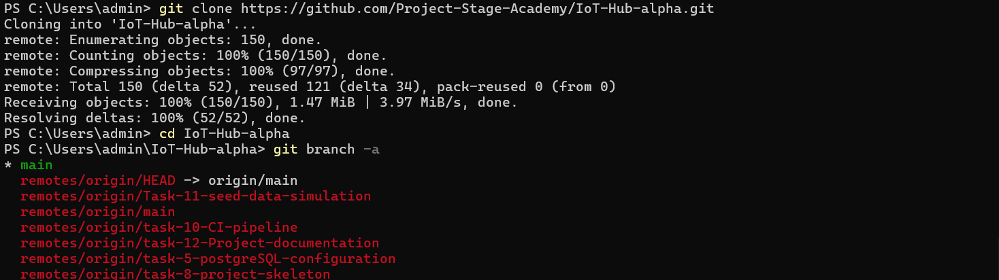
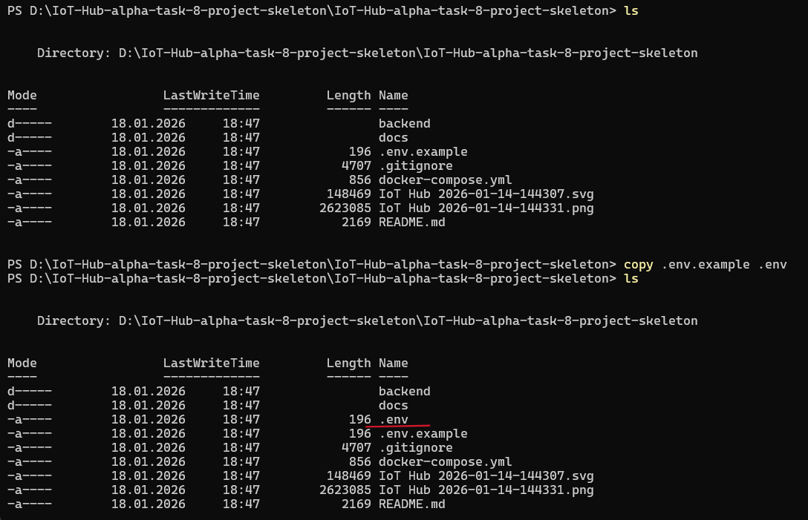
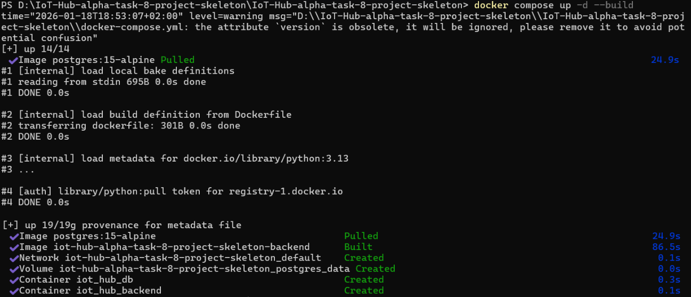

# Developer Onboarding — Monolithic MVP

This document provides a step-by-step guide for onboarding new developers and interns to the IoT Hub monolithic MVP project.
It allows a contributor with no prior knowledge of the project to clone the repository, start the local development environment, and access the Django Admin UI.

## Prerequisites

Make sure the following tools are installed:
- Git
- Docker
- Docker Compose v2

Verify installation:
```bash
git --version
docker --version
docker compose version
```
## 1) Clone the repository

Clone the repository and navigate to the project directory:
```bash
git clone https://github.com/Project-Stage-Academy/IoT-Hub-alpha.git
cd IoT-Hub-alpha
```
Switch to the required branch:
```bash
`git checkout task-8-project-skeleton`
```


## 2) Create environment file
In the folder where the `.env.example` is located, run the following comand:
* Linux / macOS / Git Bash
```bash
cp .env.example .env
```
* Windows
```bash
copy .env.example .env
```
The .env file is used only for local development and must not be committed.
At minimum, ensure the following variables exist:
* DB_NAME
* DB_USER
* DB_PASSWORD



## 3) Start the development stack
Run the following command from the project root:
```bash
docker compose up -d --build
```
This will:
- start PostgreSQL (db service),
- build and start the Django backend (backend service),
- automatically run database migrations,
- expose the backend on port 8000.



## 4) Create a Django superuser
To access the Django Admin UI, create a superuser():
```bash
docker compose exec backend python manage.py createsuperuser
```
Follow the prompts to set username and password.


## 5) Access the Admin UI
Open the following URL in your browser:
```bash
http://localhost:8000/admin/
```
Log in using the superuser credentials created in the previous step.
