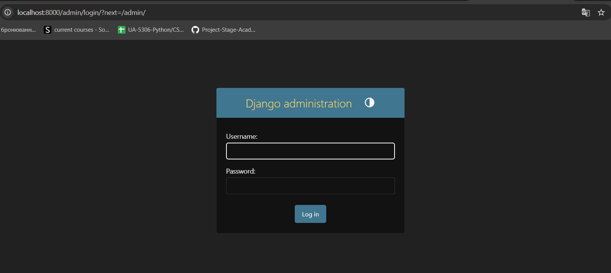
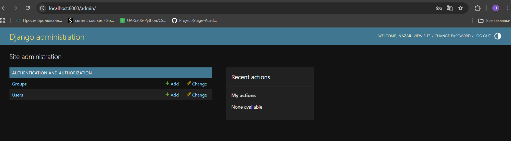

# Developer Onboarding — Monolithic MVP

This document provides a step-by-step guide for onboarding new developers and interns to the IoT Hub monolithic MVP project.
It allows a contributor with no prior knowledge of the project to clone the repository, start the local development environment, and access the Django Admin UI.

## Prerequisites

Make sure the following tools are installed:
- Git
- Docker
- Docker Compose v2

Verify installation:
```bash
git --version
docker --version
docker compose version
```
## 1) Clone the repository

Clone the repository and navigate to the project directory:
```bash
git clone `https://github.com/Project-Stage-Academy/IoT-Hub-alpha.git`
cd IoT-Hub-alpha
```
Check available branches:
```bash
git branch -a
```


For most cases, stay on the default `main` branch.
If you need to work on a specific feature branch, switch to it:
```bash
git checkout feature-branch-name
```

## 2) Create environment file
In the folder where the `.env.example` is located, run the following comand:
* Linux / macOS / Git Bash
```bash
cp .env.example .env
```
* Windows
```bash
copy .env.example .env
```
The .env file is used only for local development and must not be committed.
At minimum, ensure the following variables exist:
* DB_NAME
* DB_USER
* DB_PASSWORD


## 3) Start the development stack
Run the following command from the project root:
```bash
docker compose up -d --build
```
This will start the following services:
- **db** - TimescaleDB database (PostgreSQL 15 with TimescaleDB extension)
- **redis** - Redis cache for background tasks
- **web** - Django backend application (exposed on port 8000)
- **worker** - Celery worker for asynchronous task processing


## 4) Create a Django superuser
Use a strong password (min 12 chars, mixed case, numbers, symbols).
To access the Django Admin UI, create a superuser():
```bash
docker compose exec web python manage.py createsuperuser
```
Follow the prompts to set username and password.


**Alternative:** Use the automated setup command to create default users and groups:
```bash
docker compose exec web python manage.py setup_roles
```

This creates:
- Superuser: `admin` / `admin123`
- Admin user: `admin_user` / `admin123` (with Admin group)
- Operator user: `operator_user` / `operator123` (with Operator group)
- Viewer user: `viewer_user` / `viewer123` (with Viewer group)

## 5) Access the Admin UI
Open the following URL in your browser:
```bash
http://localhost:8000/admin/
```
Log in using the superuser credentials created in the previous step.



Аfter successful authorization, you will see this:




